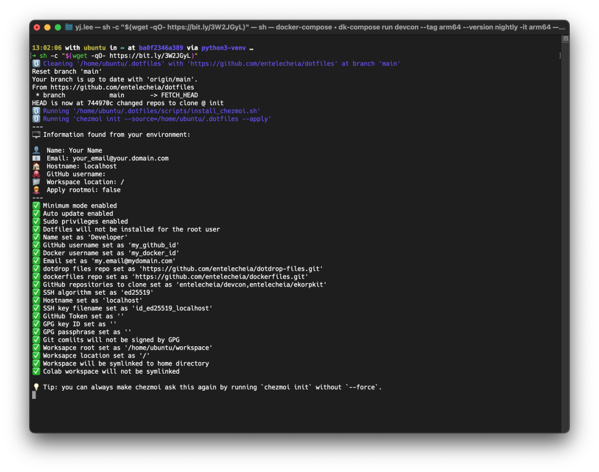

# Dotfiles

Dotfiles are configuration files that are used to customize your shell and other applications. Dotfiles are a great way to standardize your development environment. You can use the same dotfiles in your local development environment, in your CI/CD pipeline, and in your production environment.

## Getting started

### Install dotfiles

You can use the [install dotfiles script](https://dotfiles.entelecheia.in/install) to install the dotfiles on any machine with a single command. Simply run the following command in your terminal:

```bash
sh -c "$(wget -qO- https://dotfiles.entelecheia.in/install)"
```

> 💡 For most Ubuntu-based distributions, `wget` is already installed. If you want to use `curl` instead:
>
> ```bash
>  sh -c "$(curl -fsSL https://dotfiles.entelecheia.in/install)"
> ```


For unattended installations such as in a dockerfile, you can use the environment variables to initialize the dotfiles automatically. For example:

```dockerfile
# install dotfiles
ARG USER_FULLNAME="John Doe"
ARG USER_EMAIL="john.doe@email.com"
ARG GITHUB_USERNAME="john-doe"
ARG SYSTEM_HOSTNANE="devcon-arm64"

ENV USER_FULLNAME=$USER_FULLNAME
ENV USER_EMAIL=$USER_EMAIL
ENV GITHUB_USERNAME=$GITHUB_USERNAME
ENV SYSTEM_HOSTNAME=$SYSTEM_HOSTNAME
ENV WORKSPACE_LOCATION="/"
ENV APPLY_ROOTMOI=0
ENV REMOTE_CONTAINERS=1

RUN sh -c "$(wget -qO- https://bit.ly/3W2JGyL)"

CMD ["zsh"]
```

Or you can provide the environment variables in the command line:

```bash
USER_FULLNAME="John Doe" \
USER_EMAIL="john.doe@email.com" \
GITHUB_USERNAME="john-doe" \
SYSTEM_HOSTNAME="devcon-arm64" \
WORKSPACE_LOCATION="/" \
APPLY_ROOTMOI=0 \
REMOTE_CONTAINERS=1 \
sh -c "$(wget -qO- https://bit.ly/3W2JGyL)"
```

### Initialize dotfiles

When installing the dotfiles, initialization starts automatically. If you want to initialize the dotfiles manually, you can run the following command:

```bash
chezmoi init --apply
```



## Installing the font on **Windows**

1. [Download Fira Code Regular Nerd Font Complete](https://github.com/ryanoasis/nerd-fonts/raw/HEAD/patched-fonts/FiraCode/Regular/complete/Fira%20Code%20Regular%20Nerd%20Font%20Complete.ttf).
2. Open the downloaded file and click **Install**.
3. Restart **Windows Terminal** or **VS Code**.

### Configuring the font in **VS Code**

1. Open settings by pressing <kbd>Ctrl/Cmd</kbd>+<kbd>,</kbd>.
2. Change the font family to **FiraCode Nerd Font** in **_Terminal › Integrated: Font Family_**.

### Configuring the font in **Windows Terminal**

1. On **Windows Terminal**, press <kbd>Ctrl</kbd>+<kbd>,</kbd> to open the settings.
2. Go to **_Profiles -> Defaults_** in the left panel. Then, go to **_Additional settings -> Appearance_**.
3. At **_Text -> Font face_**, enable the **_Show all fonts_** option and select **_FiraCode Nerd Font_**. Like below:

## License

This project is licensed under the terms of the [MIT](./LICENSE)

## References

Large part of .chezmoitemplates and .chezmoiscripts files are taken from [felipecrs/dotfiles](https://github.com/felipecrs/dotfiles).

- [chezmoi](https://chezmoi.io)
- [dotdrop](https://github.com/deadc0de6/dotdrop)
- [dotfiles](https://dotfiles.github.io/)
- [git-secret](https://git-secret.io/)
- [Use git-secret to encrypt secrets](https://www.pascallandau.com/blog/git-secret-encrypt-repository-docker/#git-secret-installation)
- [Secrets at the Command Line](https://blog.gitguardian.com/secrets-at-the-command-line/)
- [Using Command-Line Passphrase Input for GPG with Git](https://betakuang.medium.com/using-command-line-passphrase-input-for-gpg-with-git-for-windows-f78ae2c7cd2e)

### [chezmoi](https://chezmoi.io)

Chezmoi is a tool for managing your dotfiles across multiple machines, securely. Chezmoi allows you to manage your dotfiles in a Git repository.

#### Install chezmoi

Before installing chezmoi, make sure that you have installed Git, curl, and a recent version of Go.

One-line binary install

```sh
sh -c "$(curl -fsLS get.chezmoi.io)" -- -b $HOME/.local/bin
```

Chezmoi will be installed in `$HOME/.local/bin`, so make sure that `$HOME/.local/bin` is in your $PATH.

```sh
export PATH="$HOME/.local/bin:$PATH"
```

For more information, see [Install chezmoi](https://www.chezmoi.io/install/).

#### Initialize chezmoi

If it is the first time you use chezmoi, you need to initialize it.

```sh
chezmoi init
```

Or if you want to use the existing repository as your dotfiles repository, you can use the following command.

```sh
chezmoi init https://github.com/$GITHUB_USERNAME/dotfiles.git
```

Check what changes that chezmoi will make to your home directory by running:

```sh
chezmoi diff
```

Apply the changes by running:

```sh
chezmoi apply -v
```

### [dotdrop](https://github.com/deadc0de6/dotdrop)

Save your dotfiles once, deploy them everywhere

[Dotdrop](https://github.com/deadc0de6/dotdrop) makes the management of dotfiles between different hosts easy.
It allows you to store your dotfiles in Git and automagically deploy
different versions of the same file on different setups.

It also allows to manage different *sets* of dotfiles.
For example, you can have a set of dotfiles for your home laptop and
a different set for your office desktop. Those sets may overlap, and different
versions of the same dotfiles can be deployed using different predefined *profiles*.
Or you may have a main set of dotfiles for your
everyday host and a subset you only need to deploy to temporary
hosts (cloud VM etc.) that may be using
a slightly different version of some of the dotfiles.

Features:

* Sync once every dotfile in Git for different usages
* Allow dotfile templating
* Dynamically generated dotfile contents with pre-defined variables
* Comparison between deployed and stored dotfiles
* Handling multiple profiles with different sets of dotfiles
* Easily import and update dotfiles
* Handle files and directories
* Support symlinking of dotfiles
* Associate actions to the deployment of specific dotfiles
* Associate transformations for storing encrypted/compressed dotfiles
* Provide solutions for handling dotfiles containing sensitive information

Also check out the [blog post](https://deadc0de.re/articles/dotfiles.html),
the [example](#getting-started), the [documentation](https://dotdrop.readthedocs.io/) or
how [people are using dotdrop](https://dotdrop.readthedocs.io/en/latest/misc/people-using-dotdrop/)
for more.
